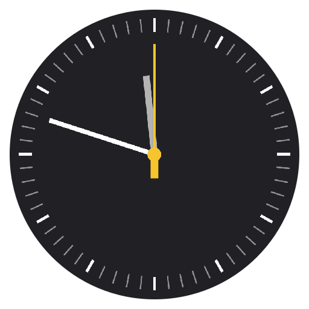
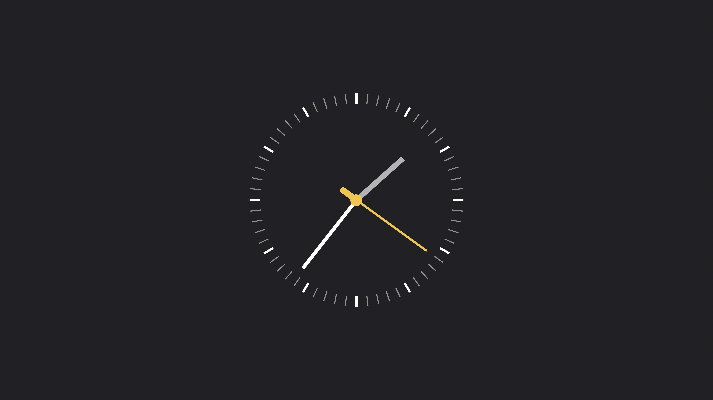
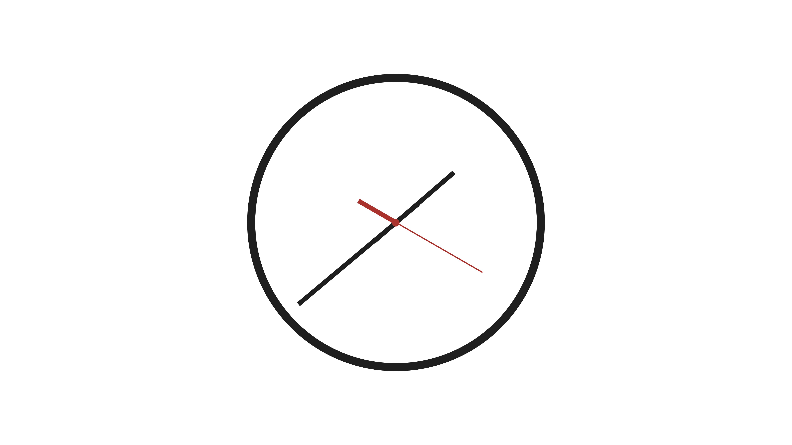
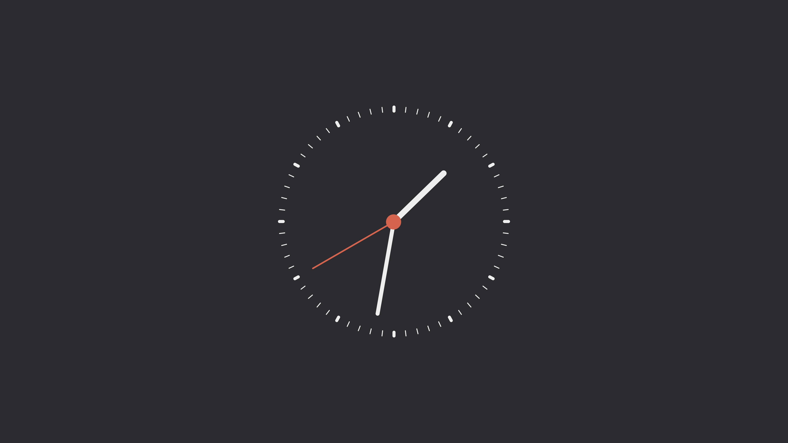
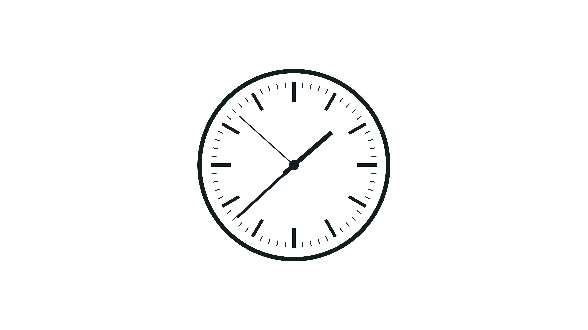
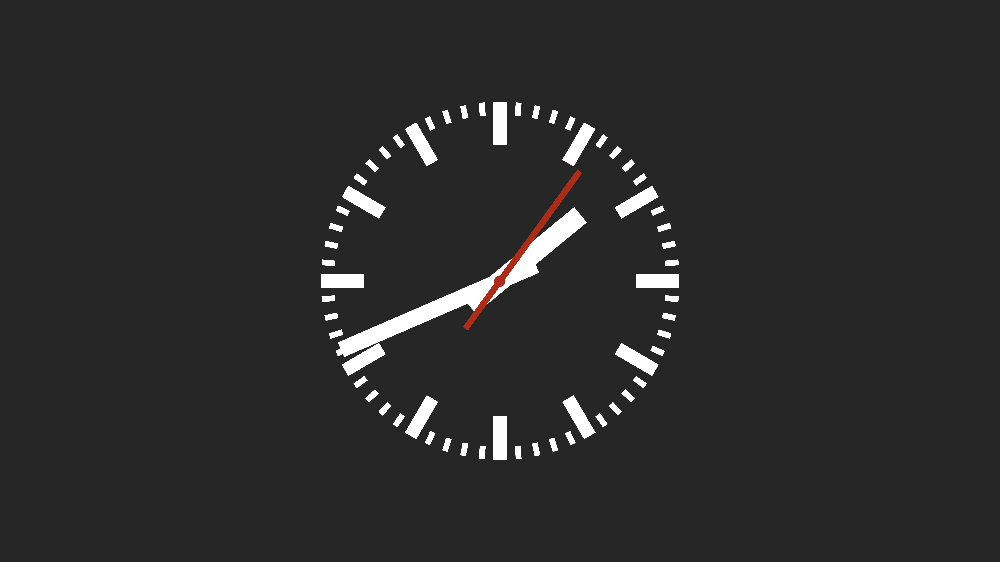
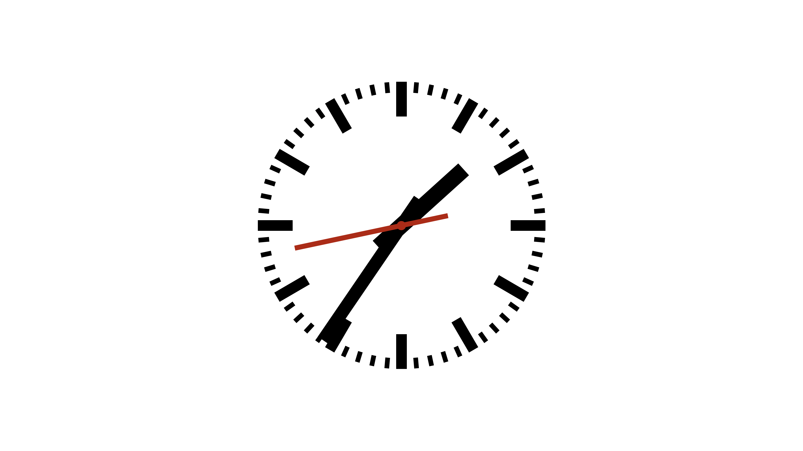

# Simple Clock Screensaver

A simple clock screensaver for macOS written entirely in Swift. It has support for skins/themes (in source code only) and can be styled to match a wide variety of analogue wall clocks.

## Skins

## Installation

- Download the [latest version](https://github.com/Wandmalfarbe/Simple-Clock-Screensaver/releases/latest) of the screensaver from the releases page.
- Extract the ZIP file by double-clicking on it.
- Install the screensaver by double-clicking on the file with the extension `.saver`.

## Credits

- The screensaver uses a `Date` extension by Daniel Love.

## License

This project is open source licensed under the BSD 3-Clause License. Please see the [LICENSE file](LICENSE) for more information.